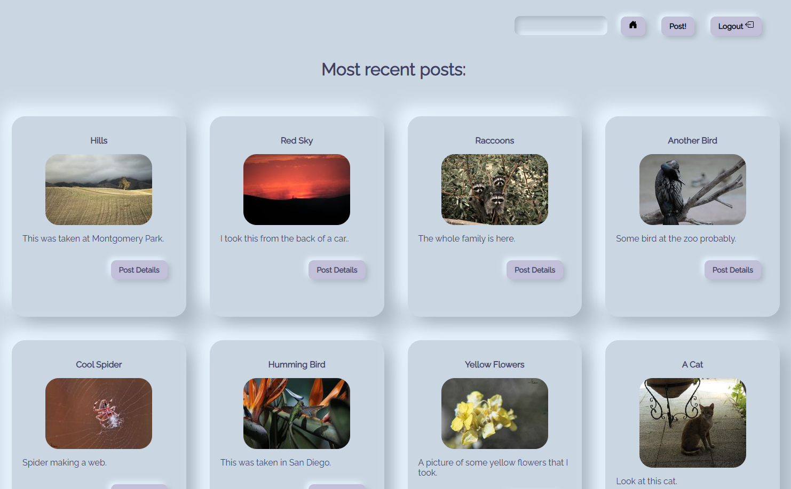
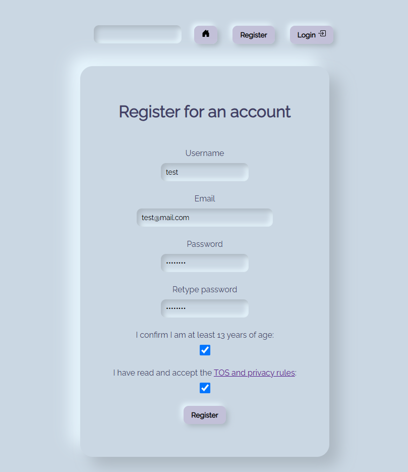
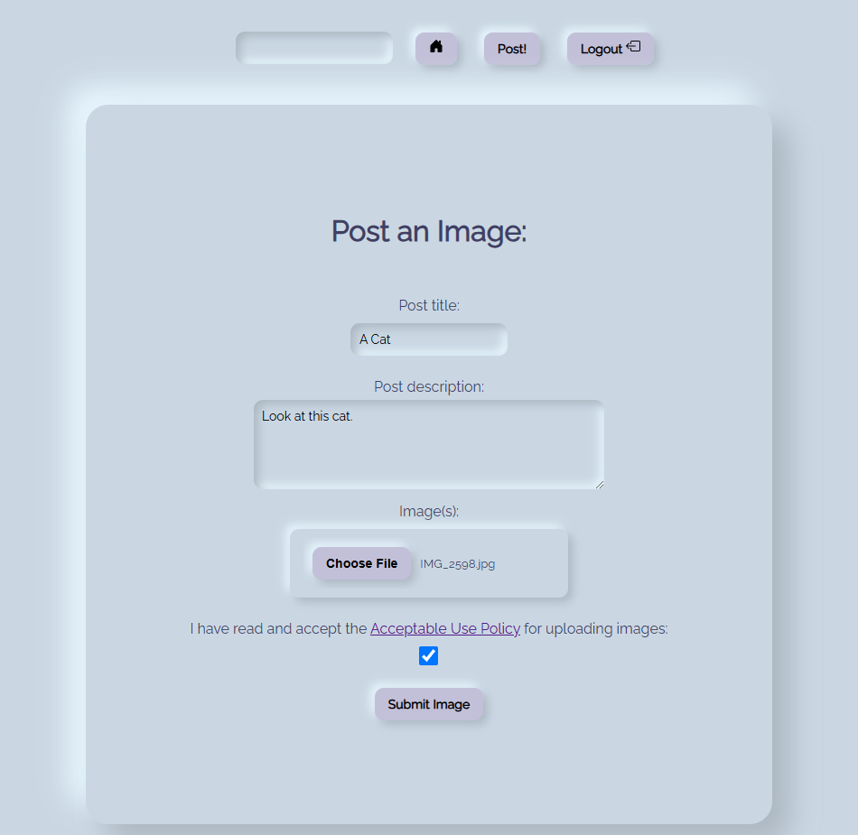
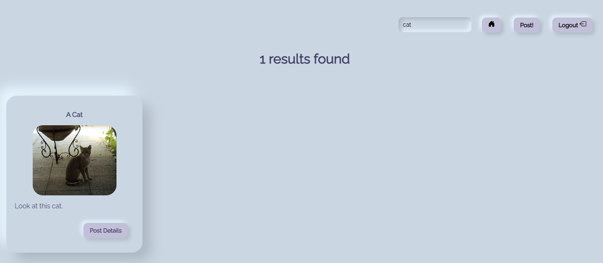
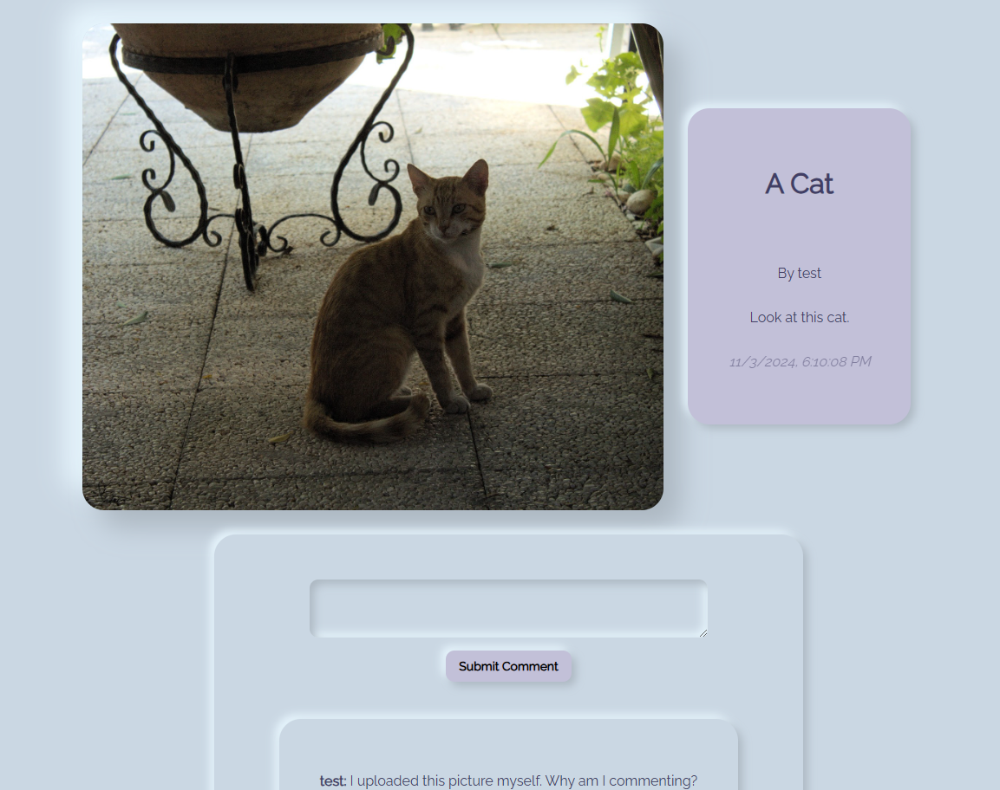

# Description

This is a simple website for uploading and viewing images following Neumorphism for the UI. It allows you to upload, comment on, and search for images. Most of the website is built using templating, with minimal client-side Javascript for updating comments.

## Homepage:



## Registering and Uploading:





## Searching



## Viewing and Image's Details



# Build Instructions

1. Use npm to install dependencies via `npm install`

2. Install MySQL and MySQL Workbench for the database.
   
   - Create a .env file in the `application\` directory that includes the following information about your database:
     
     - ```bash
       DB_HOST='host ip for db'
       DB_USER='username for your db'
       DB_PASSWORD='password for db user'
       DATABASE='photoapp'
       DB_PORT='3306'
       ```
   
   - Use the `application\config\useme.sql` file to import the database into MySQL. Ensure database is selected by double clicking on it in the schemas tab.

# Run Instructions

1. Start database.
2. Start app using `npm start` in the `application` directory.
3. Visit `localhost:3000` to view page.
